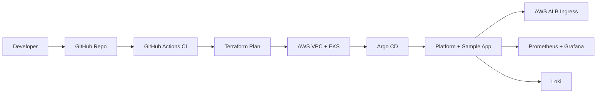

# AWS EKS Platform Blueprint

[](https://github.com/mrsddq/aws-eks-platform-blueprint/actions/workflows/ci.yml)

Production-style AWS EKS platform blueprint for a DevOps / Platform Engineer portfolio. It provisions the cloud foundation with Terraform and describes the Kubernetes platform layer with GitOps-ready manifests.

## What This Builds

- AWS VPC across three availability zones
- EKS cluster with managed node groups and Karpenter-ready IAM
- IAM roles for service accounts, cluster logging, and workload boundaries
- ALB ingress controller path for application ingress
- Argo CD application definition for GitOps delivery
- Namespaces, RBAC, HPA, PodDisruptionBudget, and sample service deployment
- Prometheus, Grafana, and Loki install values for observability
- CI checks for Terraform formatting, YAML validity, and repo completeness

## Architecture



## Repository Layout

```text
terraform/                  AWS VPC, EKS, IAM, Karpenter-ready platform
kubernetes/app/             Sample workload, service, ingress, autoscaling
kubernetes/argocd/          Argo CD Application object
kubernetes/observability/   Prometheus, Grafana, and Loki values
docs/                       Architecture, runbook, and portfolio notes
scripts/                    Local validation helpers
tests/                      Static repo quality checks
```

## Local Validation

This repository is safe to validate without AWS credentials.

```bash
make validate
```

Optional Terraform formatting:

```bash
terraform fmt -recursive -check terraform
```

## Portfolio Evidence

See [docs/PORTFOLIO_EVIDENCE.md](docs/PORTFOLIO_EVIDENCE.md) for the evidence checklist, validation commands, and interview proof points.

## Deployment Flow

1. Configure an S3 backend and DynamoDB lock table.
2. Run Terraform plan against a sandbox AWS account.
3. Apply the foundation layer.
4. Install Argo CD and point it at `kubernetes/argocd/application.yaml`.
5. Deploy observability with the Helm values in `kubernetes/observability`.
6. Review dashboards, alerts, and application health.

## What This Proves

- AWS networking and EKS platform fundamentals
- Kubernetes workload design beyond a basic deployment
- GitOps awareness with Argo CD
- Observability-first platform thinking
- CI hygiene and readable infrastructure documentation

## Cost Note

This is intentionally built as a blueprint. Running the full stack in AWS will create billable resources. Use a sandbox account, short-lived environments, and budgets before applying.
