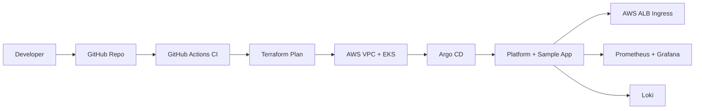

# AWS EKS Platform Blueprint

[](https://github.com/mrsddq/aws-eks-platform-blueprint/actions/workflows/ci.yml)

An AWS EKS reference blueprint with Terraform networking/cluster configuration and an explicit Kubernetes resource set for GitOps. Local validation checks syntax and workload relationships; it does not demonstrate a provisioned cluster or production readiness.

## What This Builds

- AWS VPC across three availability zones
- EKS cluster with managed node groups and Karpenter-ready IAM
- IAM roles for service accounts, cluster logging, and workload boundaries
- ALB ingress controller path for application ingress
- Argo CD application definition for GitOps delivery
- Namespaces, RBAC, HPA, PodDisruptionBudget, and sample service deployment
- Prometheus, Grafana, and Loki install values for observability
- CI checks for Terraform formatting, YAML validity, and repo completeness

## Architecture


```mermaid
flowchart LR
    Dev["Developer"] --> GitHub["GitHub Repo"]
    GitHub --> Actions["GitHub Actions CI"]
    Actions --> Terraform["Terraform Plan"]
    Terraform --> AWS["AWS VPC + EKS"]
    AWS --> Argo["Argo CD"]
    Argo --> Apps["Platform + Sample App"]
    Apps --> ALB["AWS ALB Ingress"]
    Apps --> Metrics["Prometheus + Grafana"]
    Apps --> Logs["Loki"]
```

## Repository Layout

```text
terraform/                  AWS VPC, EKS, IAM, Karpenter-ready platform
kubernetes/app/             Sample workload, service, ingress, autoscaling
kubernetes/argocd/          Argo CD Application object
kubernetes/observability/   Prometheus, Grafana, and Loki values
docs/                       Architecture, runbook, and portfolio notes
scripts/                    Local validation helpers
tests/                      Static repo quality checks
```

## Local Validation

This repository is safe to validate without AWS credentials.

```bash
python -m pip install -r requirements-dev.txt
make validate
```

Provider-aware validation (downloads Terraform providers/modules; no AWS credentials or resource creation):

```bash
terraform fmt -recursive -check terraform
make terraform-validate
# With kubectl installed, render exactly the resources Argo CD will load:
make local-demo
```

## Portfolio Evidence

See [docs/PORTFOLIO_EVIDENCE.md](docs/PORTFOLIO_EVIDENCE.md) for the evidence checklist, validation commands, and interview proof points.

## Production Docs

- [Architecture](docs/architecture.md)
- [Runbook](docs/runbook.md)
- [Incident response](docs/incident-response.md)
- [Cost estimate](docs/cost-estimate.md)
- [Security controls](docs/security-controls.md)

## Make Targets

```bash
make test
make lint
make local-demo
make security-scan
make deploy CONFIRM_DEPLOY=true
make destroy CONFIRM_DEPLOY=true
```

`deploy` and `destroy` are guarded because they create or remove billable AWS resources.

## Interview Story

This project demonstrates EKS platform provisioning, GitOps deployment, observability, autoscaling, IAM boundaries, security checks, cost awareness and production-style runbooks.

## Deployment Flow

1. Choose a currently supported EKS version and set `TF_VAR_cluster_version`; no stale version is silently selected. Configure remote state and locking.
2. Run Terraform plan against a sandbox AWS account.
3. Apply the foundation layer.
4. From a host with VPC network access, configure EKS access entries for the operator, install Argo CD, and apply `kubernetes/argocd/application.yaml`. The API endpoint is private by default.
5. Install the AWS Load Balancer Controller and metrics-server before using ingress/HPA. Provision the `grafana-admin` Secret out of band before installing observability.
6. Review dashboards, alerts, and application health.

## What This Proves

- AWS networking and EKS platform fundamentals
- Kubernetes workload design beyond a basic deployment
- GitOps awareness with Argo CD
- Observability-first platform thinking
- CI hygiene and readable infrastructure documentation

## Cost Note

This is intentionally built as a blueprint. Running the full stack in AWS will create billable resources. Use a sandbox account, short-lived environments, and budgets before applying.

## Deployment boundaries

- `kubernetes/kustomization.yaml` includes only valid workload/platform resources.
  It deliberately excludes Helm values and the Argo CD Application to avoid a self-managed application.
- Public API access is opt-in and requires explicit trusted CIDRs; unrestricted `0.0.0.0/0` is rejected.
  Private access requires a connected runner, VPN, or host in the VPC.
- Controller installation, DNS/TLS, EKS operator access, metrics-server, Karpenter controller permissions,
  remote-state configuration, and live smoke tests remain deployment prerequisites.
- CI's Checkov job is advisory (`--soft-fail`), not a security approval. Review its findings before applying.
- This repo does not collect AWS performance or cost results. No resource is created by validation.
