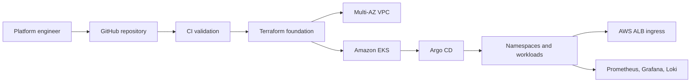
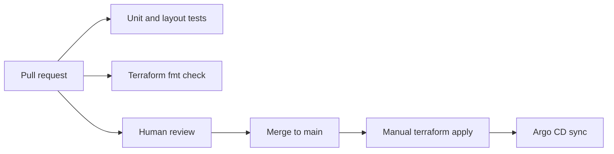
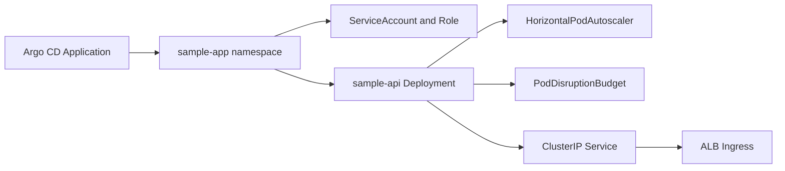
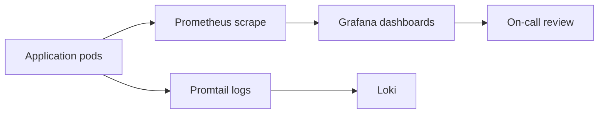

# Architecture

## High-Level Platform

## CI/CD Flow

## Kubernetes Deployment Flow

## Observability Flow

## Production Notes

- Terraform owns AWS networking, EKS and IAM foundation.
- Argo CD owns Kubernetes resources after bootstrap.
- Observability is part of the platform, not a later add-on.
- Production use should add remote state, AWS OIDC from CI, secret management and enforced admission policies.
